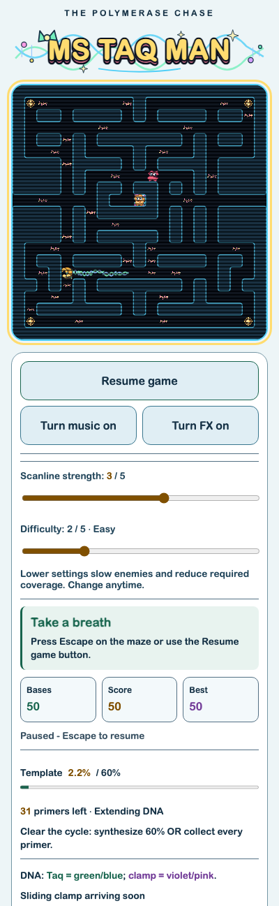
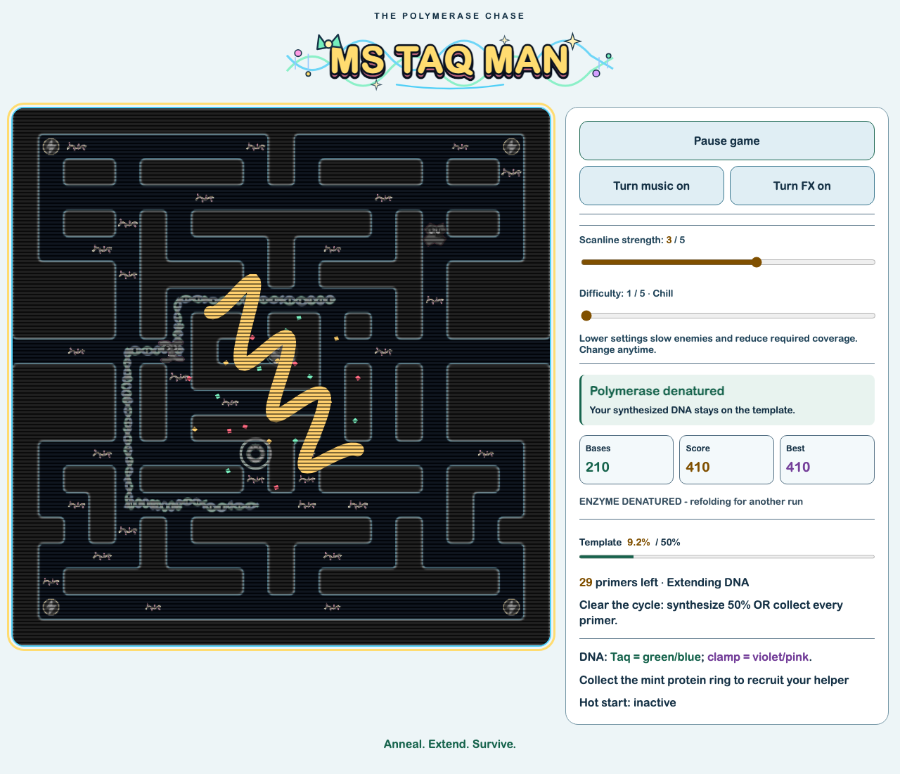

# Ms Taq Man

A playable molecular-biology arcade game: steer Taq polymerase through connected DNA mazes, collect RNA primers, and synthesize a glowing double helix while dodging animated enzyme foes.

## Synthesize your escape route

Collect a primer, then turn fresh corridors into DNA. Clear a cycle by covering
**60% of template edges at default Easy difficulty OR collecting every primer**. You never need both.

<!-- screenshots:begin (managed by screenshot-docs) -->



<!-- screenshots:end -->

These current captures show active synthesis, the stacked mobile dashboard, and
the full-board denaturation scene. The dashboard stays beside the maze on desktop
and stacks below it on phones.

- Four rotating mazes and four enzyme personalities keep the chase changing.
- Hot-start activators turn the tables: chase the frightened, unraveled enzymes.
- Helpful reagents grant speed, protection, combo boosts, or bonus points.
- Choose difficulty from Chill to Wild; Easy is the default.
- Independent music and FX controls, adjustable CRT scanlines, and reduced-motion support.

**Status:** locally verified and ready to build as a GitHub Pages static site. This
repository does not claim that an external Pages deployment is currently live.

## Your first cycle

Click **Start cycle**, then use arrow keys or WASD. Press Left from the starting
position to reach a nearby primer; keep moving and watch your helix and base count
grow. Queue turns before junctions. Use Escape or the pause button to take a break.

On touchscreens, swipe on the maze. Set difficulty to
**1 - Chill** for slower enemies. Music and effects start muted; their buttons say
what clicking will do. Your best score and settings survive browser reloads.

## Run locally

You need Node.js with npm and Python 3.12. From this checkout:

```bash
npm ci
source source_me.sh
./run_web_server.sh
```

The launcher builds the game into `dist/` and serves it on a local port. Open the
localhost URL shown in the terminal, then start a cycle. Stop the server with Ctrl-C.
Use HTTP rather than opening the HTML file directly.

To generate the GitHub Pages-ready static site without starting a server:

```bash
./build_github_pages.sh
```

## Guides and development

- [docs/USAGE.md](docs/USAGE.md): controls, scoring, reagent powers, difficulty, and sound.
- [docs/CODE_ARCHITECTURE.md](docs/CODE_ARCHITECTURE.md): simulation, rendering, UI, and audio boundaries.
- [docs/FILE_STRUCTURE.md](docs/FILE_STRUCTURE.md): edit locations, generated art, and verification commands.
- [docs/active_plans/reports/acceptance_matrix.md](docs/active_plans/reports/acceptance_matrix.md): requirement-level verification and its limits.
- [docs/CHANGELOG.md](docs/CHANGELOG.md): current changes and fixes.

Run `./check_codebase.sh` for TypeScript, lint, formatting, and simulation tests.
Run `./run_playwright_tests.sh` for browser checks after building. Repository hygiene
checks use `source source_me.sh && python3 -m pytest tests/`.

To refresh the documentation captures, start the local server and run
`node tools/capture_gameplay.mjs http://localhost:PORT/` with its printed port.

## License

Source code: [LICENSE.MIT](LICENSE.MIT).
