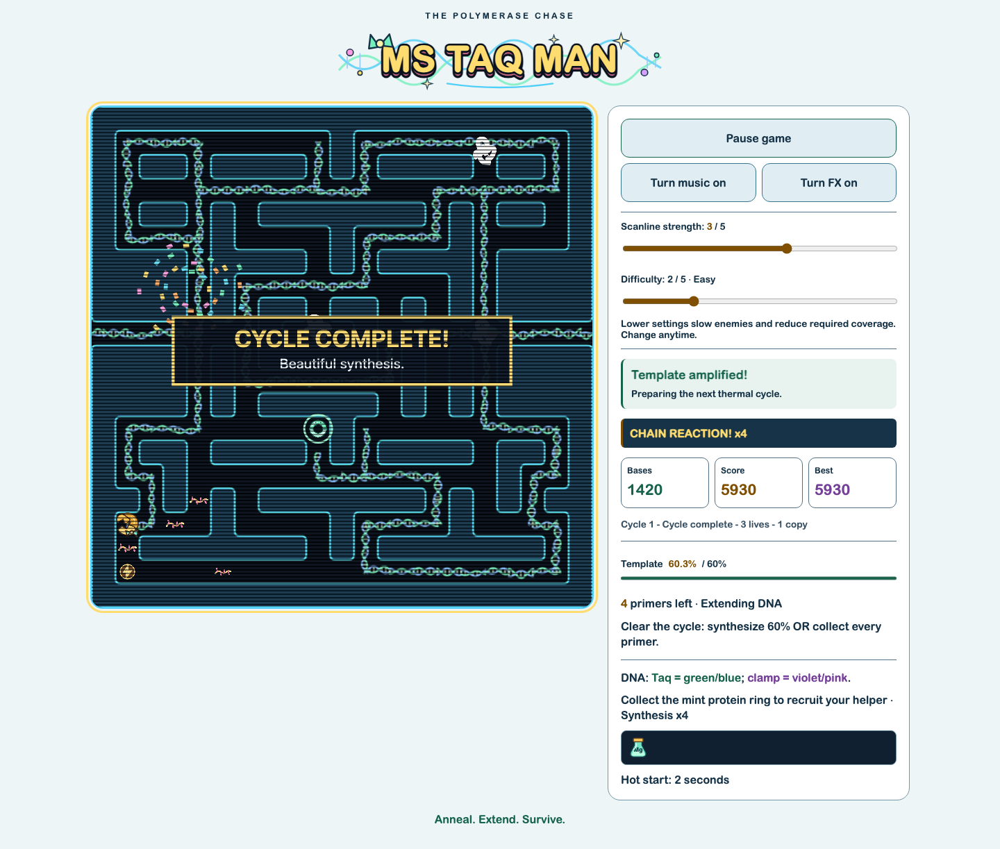

# Browser keyboard traversal

2026-09-09: replayed 48 recorded arrow-key direction changes against the production
build in Chromium. Used Playwright's controlled clock to run the normal requestAnimationFrame
loop; inputs entered through page.keyboard, without changing coverage or game state.

The first Easy cycle cleared at 60.3% coverage with four primers remaining and
three lives. The final queued edge needed about half a second beyond the simulation
recording's end to account for browser frame/input timing. The resulting screenshot
shows the actual traversal-triggered celebration.

This proves one real browser keyboard cycle with active enemies, scoring, and
rendering. It does not prove all four browser mazes, touch parity, human control
feel, audio quality, or real-time frame pacing; the replay used controlled time.
