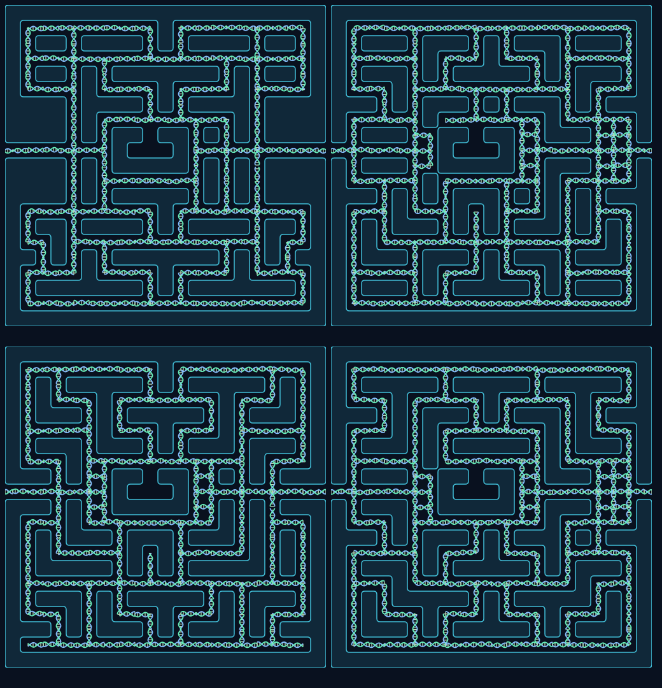

# Full-board strand rendering

2026-09-09 Chromium inspection covered every template edge in all four mazes,
then removed and re-added 100 edges per maze using the production strand layer.
This is synthetic renderer stress evidence, not a gameplay completion claim.

The corridors and connected walls remain distinguishable at full coverage.
No obvious residue appeared after repeated repairs. The result reads as a regular
helix network; the plan's more organic tangled-nest appearance remains unfinished.

## Local timing sample

504x504 logical-pixel canvases; 300 cached draws per maze; 100 removal/re-addition
pairs. Cached-draw timing includes full-canvas getImageData after every draw.
Repair timing is the pair total divided by two, with readback after each pair.

| Maze | Edges | Cached draw + readback | Mean repair update |
| --- | --- | --- | --- |
| 1 | 229 | 0.266 ms | 0.554 ms |
| 2 | 267 | 0.267 ms | 0.586 ms |
| 3 | 249 | 0.269 ms | 0.555 ms |
| 4 | 254 | 0.253 ms | 0.556 ms |

These local measurements cover the strand layer only. They do not prove a whole-game
frame budget, mobile performance, high-DPR performance, or compositor presentation
latency. Initial layer command submission measured 3.7-4.8 ms without readback.
The earlier focused repair check compared repaired alpha with a fresh render and
found differences within 4/255 from raster rounding.
